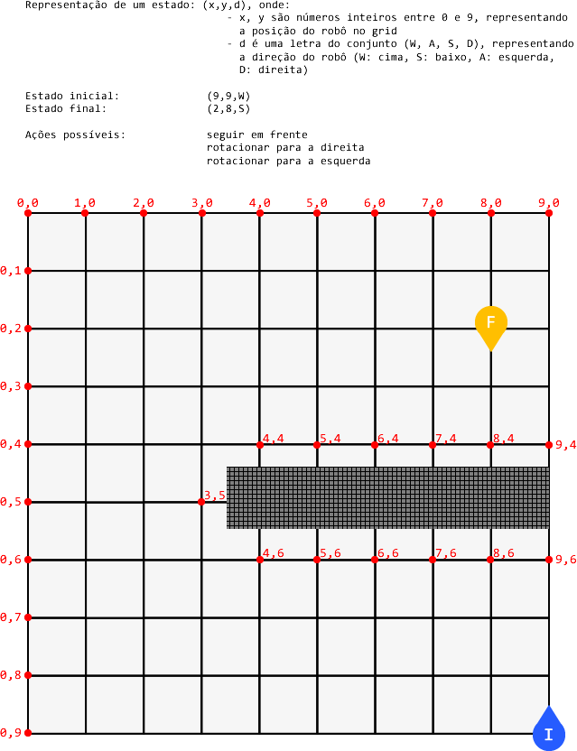

# Busca

## Autores

- Davi Boberg
- Renato Böhler

## Instruções

- Abrir o no V-REP o arquivo `cena.ttt`
- Iniciar a simulação
- Diminuir uma vez a velocidade de execução da simulação
    - isto é necessário para diminuir chance o robô 'se perder' ao executar uma das ações planejadas
- No terminal, dentro do diretório `Busca`, executar (com Python **versão 3** `python` ou `python3` - **verificar com `python --version`**) os comandos:
    - para executar a busca em largura: `python src/Busca_Largura.py`
    - para executar a busca A*: `python src/Busca_AEstrela.py`